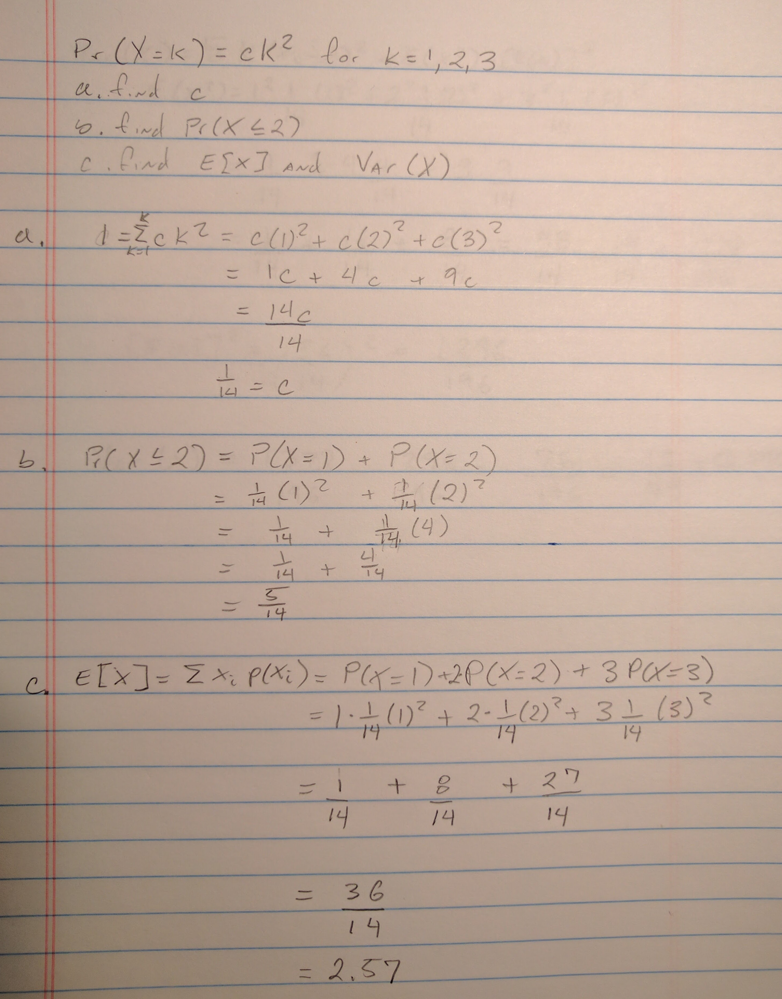
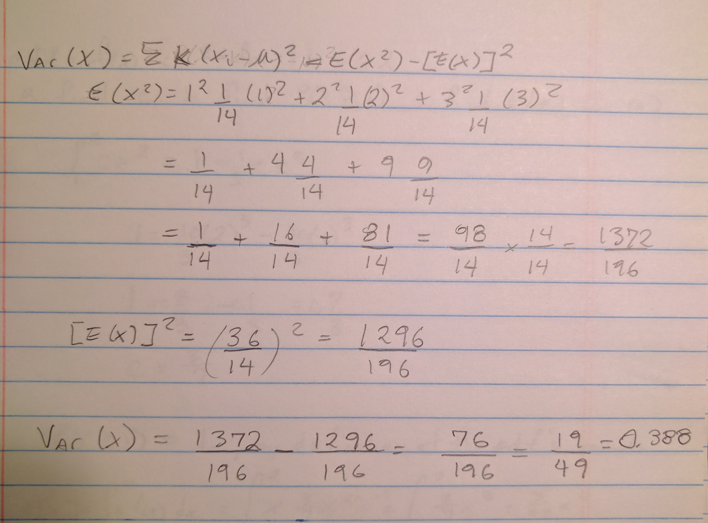
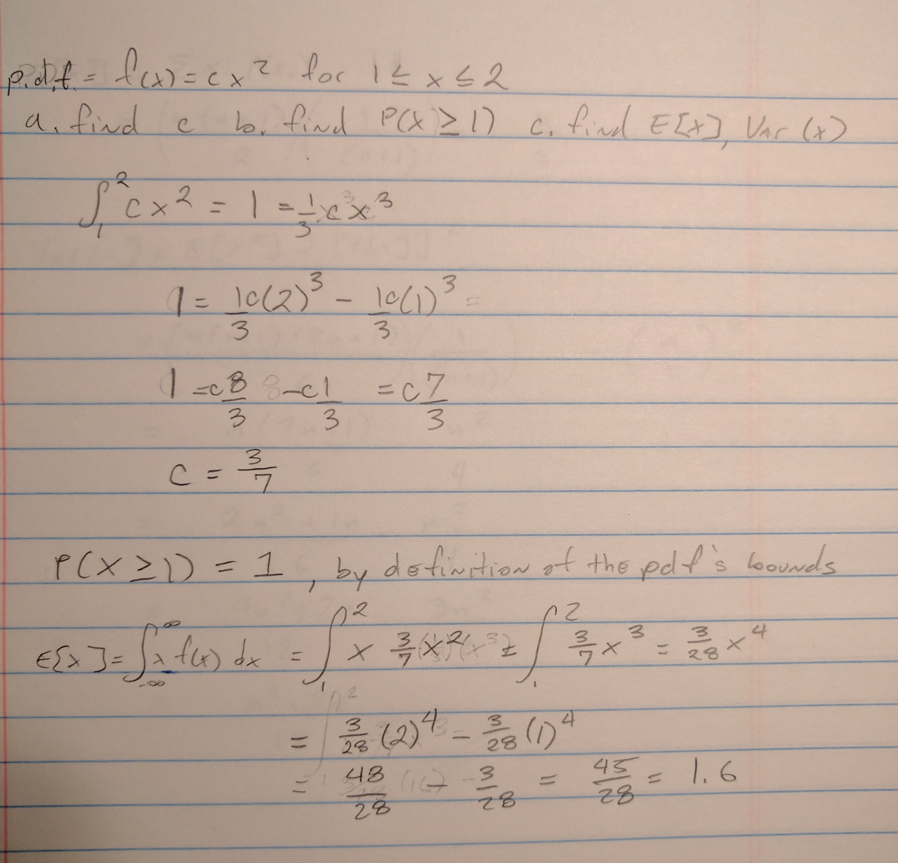
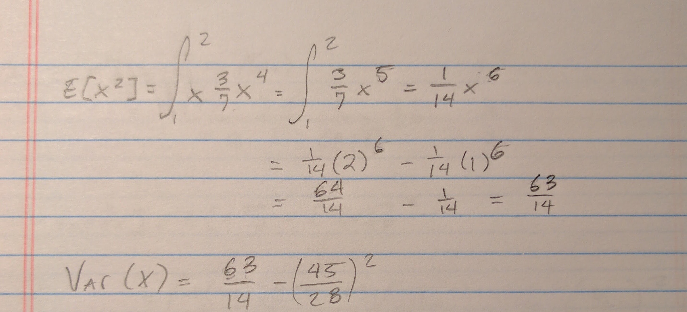
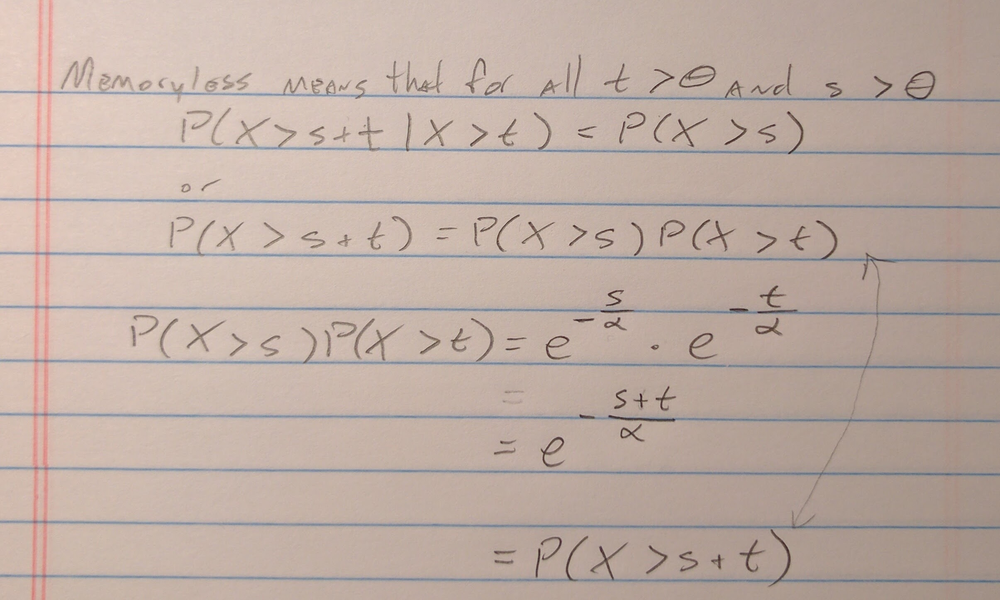
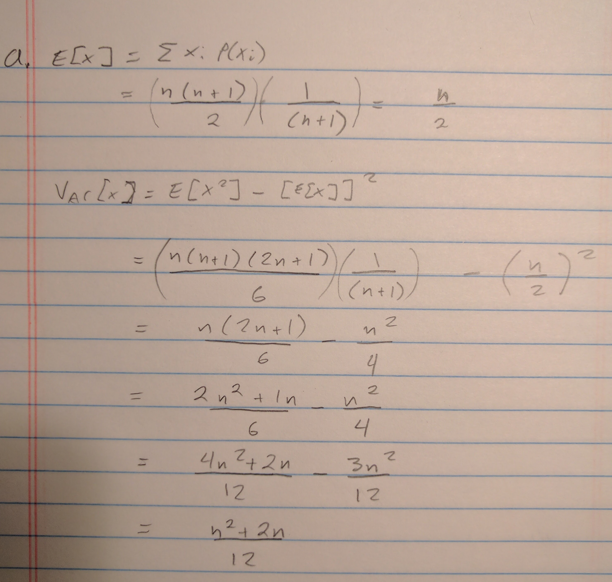

```{r}
library(ggplot2)
library(magrittr)
```
1.  

  
2.   

  

The variance calculation is completed here.
```{r}
(63/14) - (45/28)^2
```


3.  
```{r}
x <- seq(from = 0, to = 1, by = 0.01)
f.x <- (3/2) - x
y <- seq(from = 1, to = 2, by = 0.01)
f.y <- y - (1/2)

joint.rv <- cbind(x, f.x, y, f.y) %>% as.data.frame()

ggplot(joint.rv) + geom_line(aes(x=x, y=f.x)) + geom_line(aes(x=y, y=f.y))
```

```{r}
mean(f.x * x)
```

```{r}
mean(f.y * y)
```

```{r}
var(f.x)
```

```{r}
var(f.y)
```

```{r}
cov(f.x, f.y)
```


4.   
```{r}
obs <- c(7.3, 6.1, 3.8, 8.4, 6.9, 7.1, 5.3, 8.2, 4.9, 5.8)
(X.bar <- sum(obs) / length(obs))
```

```{r}
(S2 <- cov(obs, obs))
```

```{r}
t.test(obs)
```

```{r}
sigma = sqrt(S2)                  
st.error = sigma/sqrt(length(obs))     
margin.error = qnorm(.975) * st.error      
X.bar + c(-margin.error, margin.error) 
```


5.  


6.  
$\lambda = 1$, therefore the expected value of a give random variable $X_i$ is 1 and the variance is 1. The expected value of the sequence of random variables is 100. The Central Limit Theorm means that if we repeatedy sample from this exponential distribution, the resulting calculations of mean and variance will vary according to the normal distribution with a mean and variance equal to that of the original distribution. This problem specifically asks for the summation over 100 random variables, therefore the question simply asks for the probability of a normal distribution with mean 100 and variance 100 between 100 and 110.  

```{r}
(CLT.prob <- pnorm(110, mean = 100, sd = 10, lower.tail = TRUE) - 
   pnorm(100, mean = 100, sd = 10, lower.tail = TRUE))
```

This is can be confirmed via simulation:
```{r}
exp.sim <- function(){return(rexp(100) %>% sum())}

CLT.results <- replicate(1000, exp.sim())

qplot(CLT.results, geom = "density")

(sim.prob <- length(which(CLT.results >= 100 & CLT.results <= 110)) / length(CLT.results))
```


5.13



5.14
The integral of the pdf is $-e^{(-0.4x)}$.  

```{r}
satellite.pdf <- function(years){return(-exp(-0.4 * years))}
(yr.prob.5 <-  1 - (satellite.pdf(5) - satellite.pdf(0)))
```

```{r}
(yr.prob.3.6 <- satellite.pdf(6) - satellite.pdf(3))
```


5.39
a. 
What is the distribution of the length of the linkage?  

$linkage.length ~ N(150, 0.25)$  

This is can be confirmed via simulation:  
```{r}
linkage.length <- function(){
  len <- rnorm(1, 60, sqrt(0.09)) + rnorm(1, 40, sqrt(0.05)) + rnorm(1, 50, sqrt(0.11))
  return(len)
}

linkage.length.sim <- replicate(1000, linkage.length())
summary(linkage.length.sim); var(linkage.length.sim)
```

b.  
```{r}
1 - pnorm(150.2, mean = 150, sd = sqrt(0.25))
```

c. 

```{r}
pnorm(150.21, mean = 150, sd = sqrt(0.25)) - pnorm(149.83, mean = 150, sd = sqrt(0.25))
```

