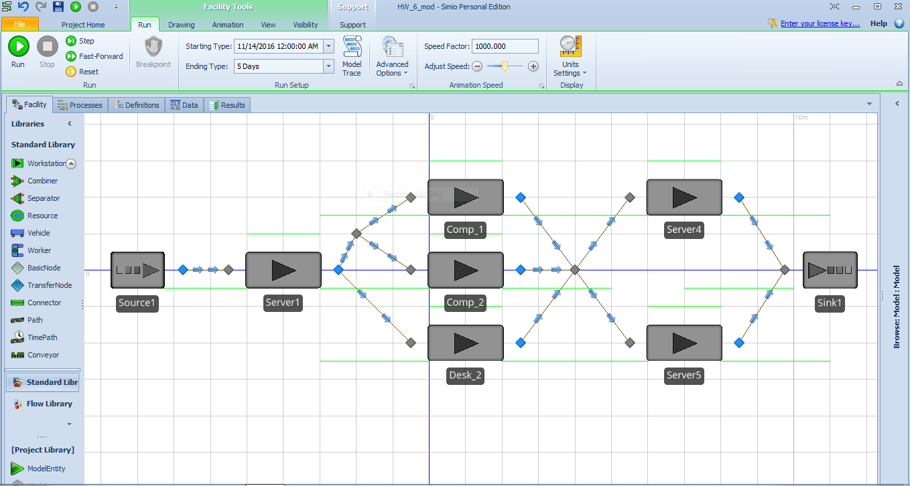

```{r, echo=FALSE, message=FALSE, error=FALSE, warning=FALSE}
library(ggplot2)
```

#1
a. The model requires:  
**sources:** one source, which represents applicants arriving at the facility.  
**servers:** five servers, representing one check in desk, two testing desks, and two check out computers.  
**sinks:** one sink, representing applicants leaving the facility. 

b.  


c.    
I chose a model runtime of 8 hours to represent one working day. It is necissary to reset the model at the end of each day to simulate a closing time - it is unrealistic to assume the facility can just run continuously 24 hours a day for multiple days. The queues must be cleared and restarted.

**Results**  
Average time in system: 1.3 hrs  
Maximum time in system: 2.0 hours  
Number entered in system: 58  
Number exited: 49  
This indicates some applicants were left over at closing time.   
  
Precent Utilizations:  
Server 1 Check in: 98.9%  
Server 2 Exam Clerk: 43.9%  
Server 3 Exam Clerk: 46.0%  
Server 4 Check-out Computer: 57.0%   
Server 5 Check-out Computer: 32.2%  
  
d.    


#2   
a. 


b. 


c. Calculated

#6.1
System: a tool crib that services a large group of mechanics 
Interarrival times: exponential distribution
Service times: exponental distribution
Mean time between arrivals: 4 minutes
Average service time: 3 minutes
Attendant pay: $10 per hour
Mechanic pay: $15 per hour

*Would it be advisable to have a second tool-crib attendant?*  

```{r}

  

```


#6.2
*A two-runway (onefor landing, one for take off) airport is being designed. The time to land an airplan is exponentially distributed, with a mean of 1.5 minutes. If airplane arrivals occur at random, what arrival rate can be tolerated if the average wait in the sky is not to exceed 3 minutes?*

```{r}

```

